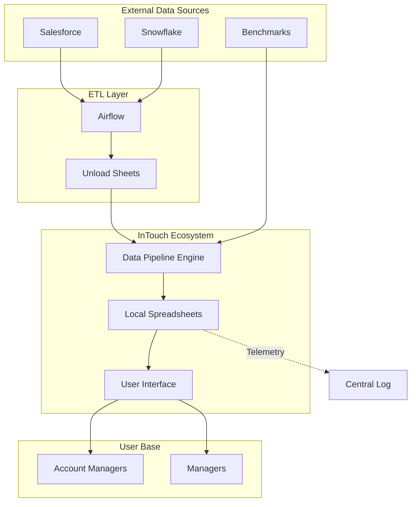
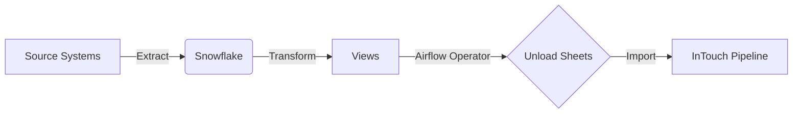
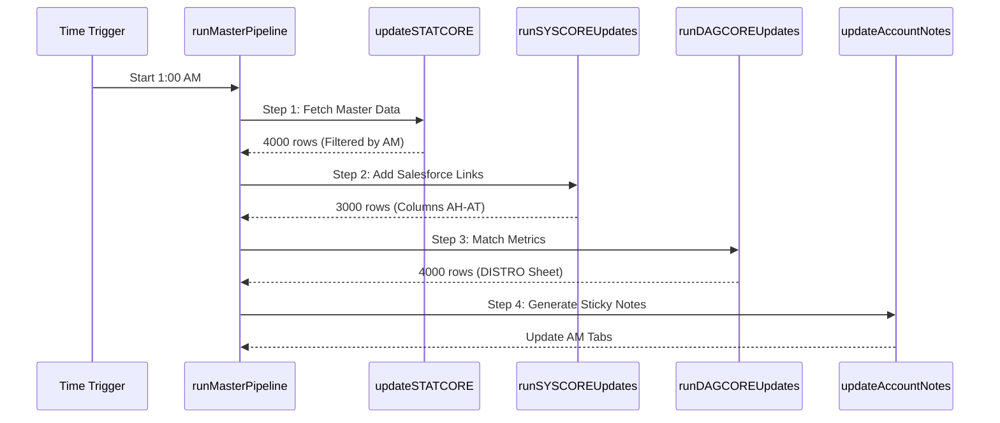
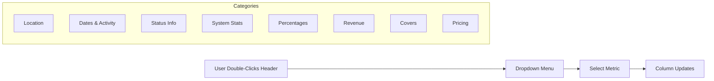
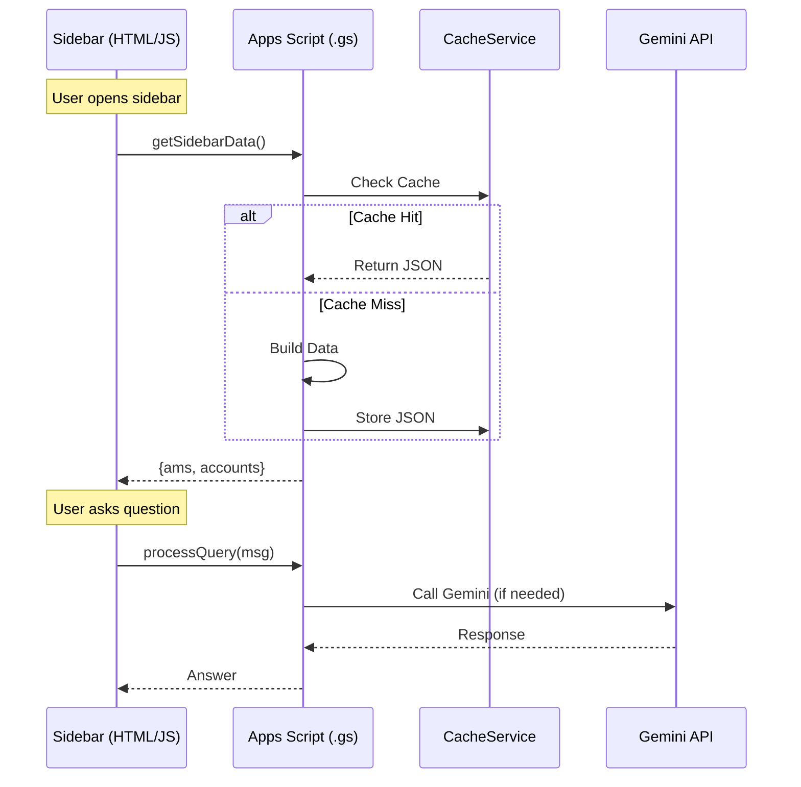
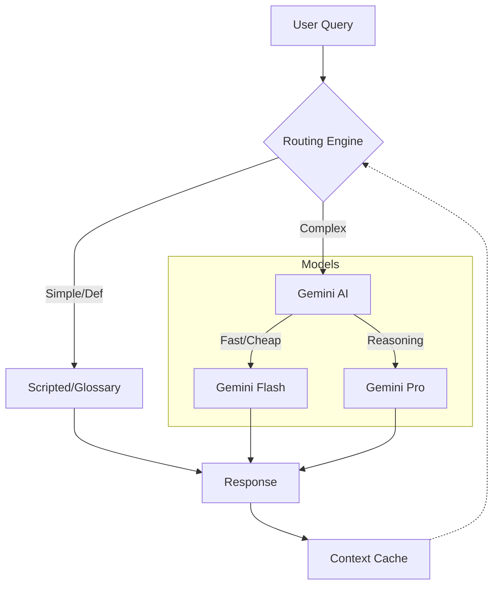
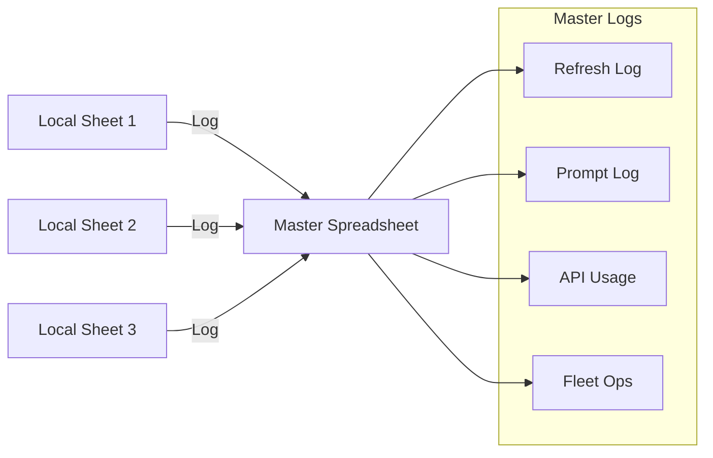

# InTouch System Documentation

> **📘 Interactive Developer Docs**: For a more immersive experience, visit the **[Interactive Developer Docs Site](https://njacobs-rss.github.io/intouch/)**.

Welcome to the comprehensive documentation for **InTouch AI**, the all-in-one account management system for RSS. This document serves as both a **User Guide** for Account Managers and a **Technical Reference** for developers.

---

## Table of Contents

1. [System Overview](#1-system-overview)
2. [Data Architecture](#2-data-architecture)
3. [Spreadsheet Structure](#3-spreadsheet-structure)
4. [User Interface](#4-user-interface)
5. [AI Functionality](#5-ai-functionality)
6. [Fleet Operations & Logging](#6-fleet-operations--logging)
7. [Strategic Frameworks](#7-strategic-frameworks)
8. [User Guide](#8-user-guide)
9. [Developer Reference](#9-developer-reference)

---

## 1. System Overview

InTouch is a **thick-client Google Apps Script system** designed for **RSS Account Managers and leaders**. It aggregates data from Salesforce, Snowflake, and external benchmarks into ~15 local spreadsheets, providing a unified interface for portfolio management, meeting preparation, and strategic analysis.

### High-Level Architecture

### Key Capabilities

| Capability | Description |
|------------|-------------|
| **Data Sync** | Pulls 30k+ rows from external spreadsheets nightly. Uses batch processing (3-4k rows) with `flush()` for stability. |
| **User Views** | Creates personalized AM tabs filtered from master STATCORE. Dynamic sticky notes generated from NOTE_CONFIG rules. |
| **AI Integration** | Sidebar with Gemini-powered chat for portfolio insights. Smart routing: Scripted → Glossary → Cached → API. |
| **Presentations** | Auto-generates Slides + Sheets with benchmark data. Template cloning with chart linking. |
| **Fleet Ops** | Manages multiple InTouch files across regions. Central logging for monitoring and analytics. |

---

## 2. Data Architecture

### Upstream ETL (Snowflake → Sheets)

Data originates in Salesforce and Snowflake, is processed via Airflow, and "unloaded" into intermediate Google Sheets (EDS) which InTouch consumes.

#### Destination Matrix (EDS)

| Destination | Variant | Source | ID (Partial) |
|-------------|---------|--------|--------------|
| **STATCORE** | Global / Intl | VW_GLOBALREPORT | `1bh4XfKM...` |
| **DAGCORE** | Global / Intl | RIDSTATS, CHARM, POS | `1Rp42Piv...` |
| **SYSCORE** | System Status | Events & Tasks Aggregation | `1V4C9mIL...` |

### Data Pipeline Engine

The nightly pipeline runs at **1:00 AM local time** via `runMasterPipeline()`.

### External Data Sources

The system integrates with multiple external resources:

#### Spreadsheets (Data Sources)

| ID | Name | Sheet | Purpose | Source |
|----|------|-------|---------|--------|
| `1Qa3S3USt-TOd...` | Statcore NA Snowflake Unload | StatcoreNA | Base account data (33 cols A-AG) | `STATCORE.js:31` |
| `1V4C9mIL4ISP4...` | SYSCORE | SEND | Salesforce/Stripe links (16 cols A-P) | `STATCORE.js:147` |
| `1atxJQcNKTJyE...` | DAGCORENA | SEND | Distribution metrics (54 cols A-BB) | `STATCORE.js:306` |
| `1yiqY-5XJY2k8...` | Central Logging | Log, Refresh, API_Usage | Fleet-wide operation logs | `Main.js:12` |
| `174CADIuvvbFn...` | Insights \| Usage & Support | Runtime logs | BI cloning runtime/error tracking | `AiOpsFunctions.js:1143` |
| `1FhLSSmCb4bEa...` | biz_insights_agg_tables | metro, nbhd, macro | Benchmark data for BI presentations | `BizInsights.js:136` |

#### Folders (Drive Storage)

| ID | Name | Purpose | Source |
|----|------|---------|--------|
| `1oqbXf4CPouog...` | InTouch | Fleet spreadsheet files | `FleetCommander.js:31` |
| `1lt4n-LZe8ufM...` | BI PUBLISHED | BI_Prod_Sheet/Slides templates | `FleetCommander.js:253` |

#### External URLs

| URL | Purpose | Source |
|-----|---------|--------|
| `opentable.my.salesforce.com` | Salesforce task/event hyperlinks | `STATCORE.js:128` |
| `guestcenter.opentable.com/restaurant/` | Guest Center restaurant links | `STATCORE.js:129` |
| `preset.io/.../dashboard/170/` | Preset dashboard with native filters | `STATCORE.js:415` |
| `preset.io/.../dashboard/2083/` | Preset dashboard visualization | `STATCORE.js:423` |
| `generativelanguage.googleapis.com` | Gemini API for AI responses | `InTouchGuide.js:2872` |

---

## 3. Spreadsheet Structure

### Core Sheets

| Sheet | Purpose | Key Columns |
|-------|---------|-------------|
| `STATCORE` | Master account data | A=RID, E=Name, F=Parent, G=Metro, N=AM |
| `DISTRO` | Distribution metrics | A=RID, Revenue, CVR data |
| `SETUP` | Configuration | B3:B16=AM names, H3=Slides ID, H5=Sheets ID |
| `NOTE_CONFIG` | Note rules | A=Expression, B=Format, C=Template, D=Break |
| `Refresh` | Pipeline logs | Process, Timestamp, Count, Duration, Status |
| `Focus20` | Priority accounts | Tagged from Smart Select |
| `[AM Name]` | Per-AM views | Filtered copies of STATCORE |

### Dynamic Column Headers

Users can customize their view by double-clicking column headers in Row 2.

### Sticky Notes & Smart Select

- **Sticky Notes**: Hover over Column C to see a dynamic HTML note with account health, contract status, and metrics.
- **Smart Select**: Checkbox in Column D. Checking a box triggers `tagFocus20Status()`, adding the account to the **Focus20** priority list and timestamping it.

---

## 4. User Interface

### Client-Server Communication

The sidebar (HTML/JS) communicates with the backend (Apps Script) via `google.script.run`.

### Menu Structure

- **InTouch✔ai**: Main tools (AI Panel, Export)
- **Admin Functions**: Fleet management, Tab creation, Focus20 manual tools, Pipeline triggers

---

## 5. AI Functionality

### AI Chat Architecture

The chat system uses a **Dual-Model Architecture** with intelligent routing.

### Presentation Generation

Automated deck creation flow:

1.  **Resolve Templates**: IDs from `SETUP` sheet.
2.  **Create Worksheet**: Clone template, populate with account data.
3.  **Populate Benchmarks**: Fetch external benchmark data (Metro/Macro).
4.  **Create Slides**: Clone slide template.
5.  **Link Charts**: Batch update charts in Slides to point to new Worksheet data.

---

## 6. Fleet Operations & Logging

### Central Logging Architecture

All local spreadsheets report telemetry to a **Master Spreadsheet** in real-time.

### Fleet Commander

Admin panel for managing the fleet:
- **Deploy Update**: Push code/sheet updates to all files.
- **Data Refresh**: Trigger pipelines across the fleet (Queue-based to avoid timeouts).
- **Test API**: Verify Gemini connectivity fleet-wide.

---

## 7. Strategic Frameworks

### The Three-Layer Framework

A decision model for renewals and churn prevention.

1.  **TIME (Lifecycle)**: Where are they in the contract? (Prioritize <45 days)
2.  **SYSTEM (Value)**: Is the system used? (Fix adoption before price)
3.  **ECONOMICS (Price)**: Pricing levers (Freemium, AYCE)

### Channel Math

- **Network** = Direct + Discovery
- **Fullbook** = Network + RestRef + Phone/Walk

---

## 8. User Guide

### Getting Started
1.  Open **InTouch✔ai** → **Open InTouch AI Panel**.
2.  Navigate to your personal AM tab (named after you).

### Using Your AM Tab
- **Smart Select**: Check boxes to add accounts to your **Focus20** list.
- **Sticky Notes**: Hover over the "Notes" column for a quick health snapshot.
- **Dynamic Columns**: Double-click headers in Row 2 to change metrics (e.g., show "Revenue" instead of "Status").

### The InTouch AI Panel
- **Meeting Prep**: Search an account → "AI Brief" for a summary, "Create Deck" for slides.
- **Pricing Simulator**: Model "What-If" scenarios for Freemium vs. Pro vs. AYCE.
- **Bucket Summary**: View portfolio-level stats (Churn risk, System mix).
- **Chat**: Ask questions like "Show me my Pro accounts" or "Summarize my renewals".

### Troubleshooting
- **Sidebar won't load?** Refresh page, check browser pop-up blocker.
- **Data missing?** Check `Refresh` sheet for errors. Run "Admin Functions" → "Force Master Pipeline".
- **Chat stuck?** Try a simple query like "What is PI?".

---

## 9. Developer Reference

### File Responsibilities

| File | Purpose |
|------|---------|
| `Main.js` | Entry point, menus, triggers, logging |
| `Admin.js` | Pipeline orchestration, AM tab management |
| `STATCORE.js` | Data ingestion (ETL) |
| `DynamicNotes.js` | Sticky note generation engine |
| `AiOpsFunctions.js` | Sidebar APIs, AI integration, Prompt engineering |
| `BizInsights.js` | Slides/Sheets generation logic |
| `FleetCommander.js` | Multi-file deployment & admin tools |

### Key Functions
- `runMasterPipeline()`: Main nightly trigger.
- `updateSTATCORE()`: Fetches and filters master data.
- `processQuery(message)`: Handles AI chat routing.
- `createBizInsightsDeck(config)`: Orchestrates presentation build.
- `logInteraction(operation)`: Sends telemetry to Central Log.

### Deployment
Uses `clasp` for deployment.
- `npm run push:master`: Deploy to master script.
- `npm run push:all`: Deploy to all fleet scripts (via `multi-deploy.js`).

---
*Last Updated: January 30, 2026*
